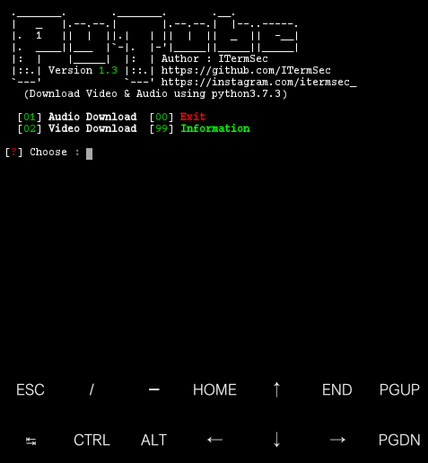

# PyTube
PyTube (Download Audio / Video using python3). 
Without having to open Google for audio / video downloads. And certainly free from advertisements.

# GitHub
```https://github.com/ITermSec/```
# Instagram
```https://www.instagram.com/itermsec_/```

# Installation KALI : 
```
$ apt-get update
$ apt-get upgrade
$ apt-get install git
$ apt-get install ffmpeg
$ apt-get install python
$ apt-get install python-pip
$ git clone https://github.com/ITermSec/pytube.git
$ cd pytube
$ pip -r requirements.lst
$ youtube-dl -U
$ python pytube.py
```

# Installation Termux : 
```
$ apt update && apt upgrade
$ pkg update && pkg upgrade
$ pkg install git
$ apt install ffmpeg
$ pkg install python
$ git clone https://github.com/ITermSec/pytube.git
$ cd pytube
$ pip install -r requirements.lst
$ youtube-dl -U
$ python pytube.py
```

# How to Stop this program?.
You must type ```CTRL+C``` for stop.

# Screenshoot


